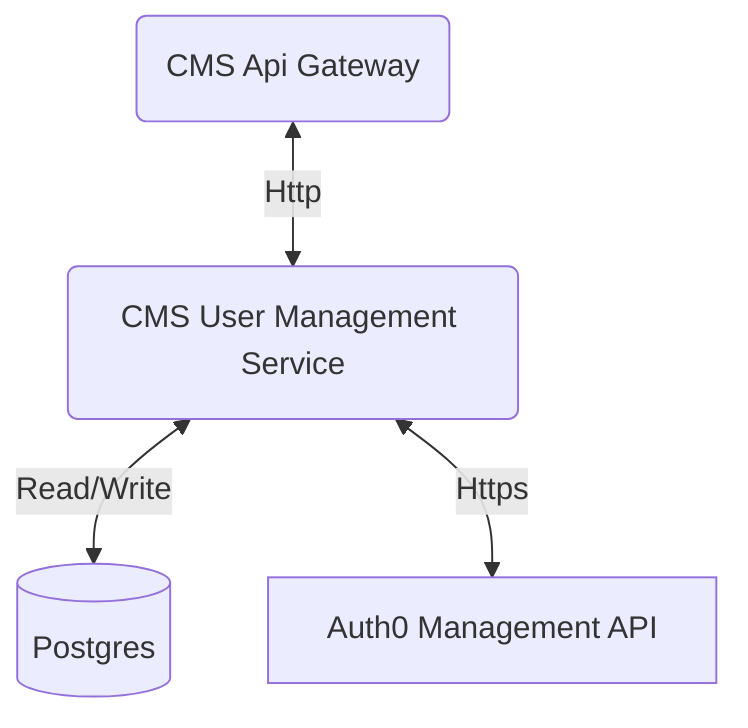

# CMS User Management

This project is meant to be a web api for managing users in a TLIS CMS.

<p align="center">
  </img>
</p>

## Architecture



## Setup project

### Required developer secrets

```bash
dotnet user-secrets set "Auth0:Domain" "<value>"
```

```bash
dotnet user-secrets set "Auth0:ClientId" "<value>"
```

```bash
dotnet user-secrets set "Auth0:ClientSecret" "<value>"
```

```bash
dotnet user-secrets set "Jwt:Authority" "<value>"
```
